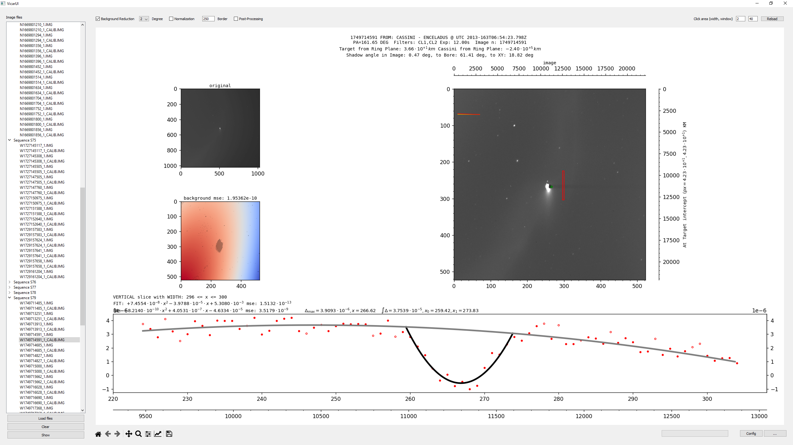
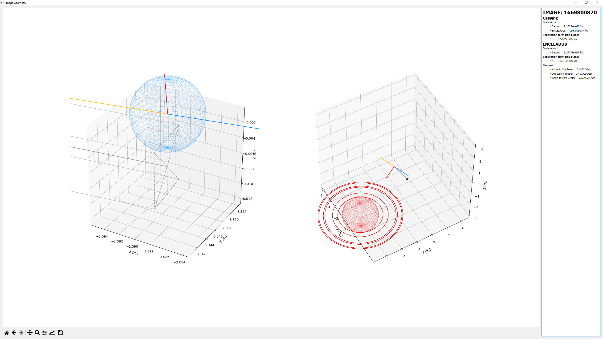

# Ring moons of Saturn

## General

This packages/program was created for my bachelor's thesis for the __Astronomy department__ at __University of Oulu,
Finland__

It consists of a reader for Vicar Image files and a viewer for analyzing images. The purpose is to extract shadow data
from the images and analyze shadow contrast.

## Info

Needs Cassini mission kernels to provide mission data
> Not here since uncompressed 37Gb or compressed 16Gb

Uses [NASA NAIF Spice](https://naif.jpl.nasa.gov/naif/) which is used through
[SpiceyPy](https://github.com/AndrewAnnex/SpiceyPy) wrapper

Parses [VICAR2](https://www-mipl.jpl.nasa.gov/external/VICAR_file_fmt.pdf) file format.

## Modules

[VicarUI](vicarui) - viewer and analysis for images

[VicarUtil](vicarutil) - reading images

Easiest to install with ``pip install -e vicarutil`` and ``pip install -e vicarui`` in a Python virtual environment.

[PyCharm](https://www.jetbrains.com/pycharm/) is highly recommended if you want need to make any changes.

## Some features:

#### Geometry viewer

#### Inspection

#### Autofit (in development)

